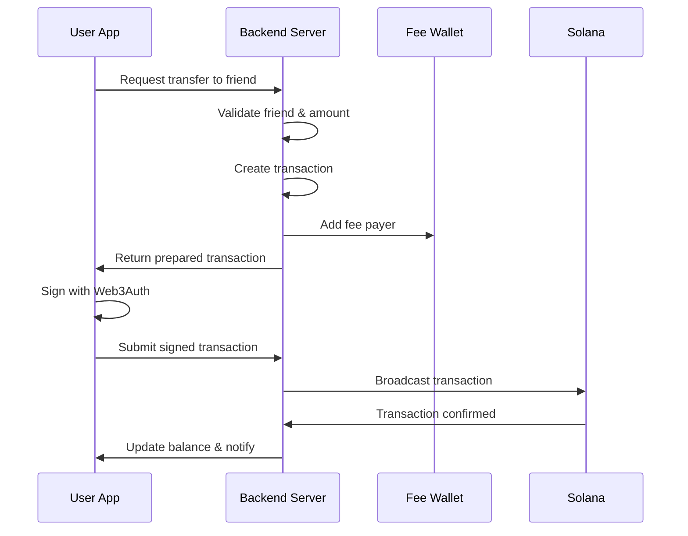

# Web3Auth Integration Specification for 7awel Crypto Wallet

## Table of Contents
1. [Overview](#overview)
2. [Architecture](#architecture)
3. [Wallet Management Strategy](#wallet-management-strategy)
4. [Backend Services Specification](#backend-services-specification)
5. [Frontend Integration](#frontend-integration)
6. [Transaction Flow](#transaction-flow)
7. [Security Considerations](#security-considerations)
8. [Implementation Timeline](#implementation-timeline)

## Overview

This document outlines the comprehensive integration plan for Web3Auth in the 7awel crypto wallet application, including:
- Non-custodial wallet creation using Web3Auth
- External wallet for fee subsidization (gas-less transactions)
- Backend transaction relay service
- Balance management strategy (blockchain vs database)
- Friend-to-friend transfer implementation

### Key Requirements
- **Platform**: Capacitor (iOS/Android/Web)
- **Blockchain**: Solana
- **Auth Provider**: Web3Auth
- **Transaction Model**: Gas-less (fees subsidized by external wallet)
- **User Experience**: Seamless Web2-like experience with Web3 security

## Architecture

### High-Level Architecture
```
┌─────────────────┐     ┌──────────────────┐     ┌─────────────────┐
│   Mobile App    │────▶│  Backend Server  │────▶│ Solana Network  │
│  (Capacitor)    │     │  (Transaction    │     │                 │
│                 │     │   Relay Service) │     │                 │
└─────────────────┘     └──────────────────┘     └─────────────────┘
        │                        │                         ▲
        │                        │                         │
        ▼                        ▼                         │
┌─────────────────┐     ┌──────────────────┐     ┌─────────────────┐
│   Web3Auth      │     │  Fee Subsidy     │────▶│  External       │
│   SDK           │     │  Wallet Manager  │     │  Hot Wallet     │
└─────────────────┘     └──────────────────┘     └─────────────────┘
```

### Component Overview

1. **Mobile App (Frontend)**
   - Web3Auth SDK integration
   - Transaction signing with user's private key
   - Balance display and transaction history
   - Friend management and transfers

2. **Backend Server**
   - Transaction relay service
   - Fee subsidization logic
   - Balance caching and optimization
   - User wallet mapping
   - Transaction monitoring

3. **External Hot Wallet**
   - Holds SOL for transaction fees
   - Managed by backend server
   - Signs fee payer portion of transactions

## Wallet Management Strategy

### 1. Wallet Creation Flow
```typescript
// Frontend: services/web3auth-service.ts
interface Web3AuthConfig {
  clientId: string;
  network: 'mainnet' | 'devnet' | 'testnet';
  chainConfig: {
    chainNamespace: 'solana';
    chainId: string;
    rpcTarget: string;
    displayName: string;
    blockExplorer: string;
    ticker: string;
    tickerName: string;
  };
}

class Web3AuthService {
  async initializeWallet(phoneNumber: string): Promise<WalletInfo> {
    // 1. Initialize Web3Auth with phone number login
    // 2. Get or create wallet
    // 3. Derive Solana keypair
    // 4. Register wallet with backend
  }
}
```

### 2. Wallet Storage Strategy

**Hybrid Approach Recommended:**
- **Primary Source**: Blockchain (real-time, accurate)
- **Cache Layer**: Backend database (performance, offline support)
- **Local Storage**: Recent transactions and balance snapshot

#### Balance Management Flow
```
1. User opens app
   └─> Check local cache (instant display)
   └─> [remove this step] Request backend cache (fast update)
   └─> Queue blockchain sync (accurate update)

2. Transaction occurs
   └─> Update local optimistically
   └─> Send to backend relay
   └─> Confirm on blockchain
   └─> Update all caches
```

## Backend Services Specification

### 1. Core Services

#### A. Transaction Relay Service
```typescript
// Backend: services/transaction-relay.service.ts
interface TransactionRelayService {
  // Prepare transaction with fee payer
  prepareTransaction(params: {
    from: PublicKey;
    to: PublicKey;
    amount: number;
    memo?: string;
  }): Promise<PreparedTransaction>;

  // Submit signed transaction
  submitTransaction(params: { // we may need partially sign transaction insted of submit which will take place on the user's device directly, right?
    signedTransaction: string;
    userId: string;
  }): Promise<TransactionResult>;

  // Monitor transaction status
  getTransactionStatus(signature: string): Promise<TransactionStatus>;
}
```

#### B. Fee Subsidy Manager
```typescript
// Backend: services/fee-subsidy.service.ts
interface FeeSubsidyService {
  // Check if user eligible for subsidy
  // e.g. user's account is suspended 
  checkEligibility(userId: string): Promise<SubsidyEligibility>;
  
  // Get fee payer wallet
  getFeePayer(): Promise<Keypair>;
  
  // Track subsidy usage
  recordSubsidy(params: {
    userId: string;
    transactionId: string;
    feeAmount: number;
  }): Promise<void>;
}
```

### 2. Database Schema

```sql
-- User wallets mapping
CREATE TABLE user_wallets (
  id UUID PRIMARY KEY,
  type // main, saving, investment
  user_id UUID REFERENCES users(id),
  wallet_address VARCHAR(44) UNIQUE,
  created_at TIMESTAMP DEFAULT NOW(),
  last_active TIMESTAMP
);

-- Transaction records
CREATE TABLE transactions (
  id UUID PRIMARY KEY,
  user_id UUID REFERENCES users(id),
  signature VARCHAR(88) UNIQUE,
  from_address VARCHAR(44),
  to_address VARCHAR(44),
  amount DECIMAL(20, 9),

  // other fee fields based on the operation
  app_fee // our fee
  network_amount DECIMAL(20, 9),
  status VARCHAR(20),
  type VARCHAR(20),
  metadata JSONB,
  created_at TIMESTAMP DEFAULT NOW(),
  confirmed_at TIMESTAMP
);

-- Fee subsidy tracking
CREATE TABLE fee_subsidies (
  id UUID PRIMARY KEY,
  user_id UUID REFERENCES users(id),
  transaction_id UUID REFERENCES transactions(id),
  fee_amount DECIMAL(20, 9),
  subsidy_type VARCHAR(20), (initialize, send)
  created_at TIMESTAMP DEFAULT NOW()
);
```

### 3. API Endpoints

```yaml
# Transaction endpoints
POST   /api/v1/wallet/prepare-transaction
POST   /api/v1/wallet/submit-transaction
GET    /api/v1/wallet/transaction/{signature}
GET    /api/v1/wallet/transactions
```

## Frontend Integration

### 1. Web3Auth Setup

```typescript
// services/web3auth.service.ts
import { Web3Auth } from "@web3auth/modal";
import { SolanaPrivateKeyProvider } from "@web3auth/solana-provider";
import { Connection, PublicKey, Transaction } from "@solana/web3.js";

export class Web3AuthService {
  private web3auth: Web3Auth;
  private provider: SolanaPrivateKeyProvider;
  
  async initialize(): Promise<void> {
    const chainConfig = {
      chainNamespace: "solana",
      chainId: "0x1", // Mainnet
      rpcTarget: process.env.SOLANA_RPC_URL,
      displayName: "Solana Mainnet",
      blockExplorer: "https://explorer.solana.com",
      ticker: "SOL",
      tickerName: "Solana",
    };

    this.web3auth = new Web3Auth({
      clientId: process.env.WEB3AUTH_CLIENT_ID,
      chainConfig,
      web3AuthNetwork: "mainnet",
    });

    await this.web3auth.initModal();
  }

  // we need to add an additional step to the login/signup flows to accomodate: creating user's wallet OR fetching wallet(?)
  async login(phoneNumber: string): Promise<WalletInfo> {
    // Use SMS passwordless login
    const user = await this.web3auth.connect({
      loginProvider: "sms_passwordless",
      extraLoginOptions: {
        login_hint: phoneNumber,
      },
    });

    return this.getWalletInfo();
  }

  async signTransaction(transaction: Transaction): Promise<string> {
    const provider = await this.getProvider();
    const signedTx = await provider.signTransaction(transaction);
    return signedTx.serialize().toString('base64');
  }
}
```

### 2. Transaction Service Integration

```typescript
// services/blockchain-transaction.service.ts
export class BlockchainTransactionService {
  constructor(
    private web3auth: Web3AuthService,
    private httpClient: HttpClient
  ) {}

  async sendMoney(params: {
    toAddress: string;
    amount: number;
    memo?: string;
  }): Promise<TransactionResult> {
    // 1. Prepare transaction on backend
    const prepared = await this.httpClient.post<PreparedTransaction>(
      '/api/v1/wallet/prepare-transaction',
      {
        to: params.toAddress,
        amount: params.amount,
        memo: params.memo,
      }
    );

    // 2. Sign with user's wallet
    const signedTx = await this.web3auth.signTransaction(
      prepared.transaction
    );

    // 3. Submit to backend
    const result = await this.httpClient.post<TransactionResult>(
      '/api/v1/wallet/submit-transaction',
      { signedTransaction: signedTx }
    );

    return result;
  }
}
```

### 3. Platform Integration (Capacitor)

```typescript
// platform/capacitor-web3.ts
import { registerPlugin } from '@capacitor/core';

interface Web3AuthPlugin {
  initialize(options: Web3AuthConfig): Promise<void>;
  login(options: LoginOptions): Promise<WalletInfo>;
  logout(): Promise<void>;
  signTransaction(tx: string): Promise<string>;
  getPrivateKey(): Promise<string>;
}

const Web3AuthCapacitor = registerPlugin<Web3AuthPlugin>('Web3Auth');

export class CapacitorWeb3AuthService {
  async initialize(): Promise<void> {
    if (Capacitor.isNativePlatform()) {
      // Use native plugin
      await Web3AuthCapacitor.initialize({
        clientId: process.env.WEB3AUTH_CLIENT_ID,
        network: 'mainnet',
      });
    } else {
      // Use web SDK
      await this.web3auth.initialize();
    }
  }
}
```

## Transaction Flow

### 1. Friend-to-Friend Transfer Flow



### 2. Transaction States

```typescript
enum TransactionStatus {
  PENDING = 'pending',           // Created, awaiting signature
  SIGNED = 'signed',            // Signed by user
  SUBMITTED = 'submitted',      // Sent to blockchain
  CONFIRMED = 'confirmed',      // Confirmed on chain
  FAILED = 'failed',           // Failed at any stage
  EXPIRED = 'expired'          // Not completed in time
}
```

## Security Considerations

### 1. Private Key Management
- **User Keys**: Never leave device, managed by Web3Auth
- **Fee Payer Keys**: Stored in secure backend HSM/KMS
- **Key Rotation**: Regular rotation for fee payer wallet

### 2. Transaction Security
```typescript
// Backend validation
class TransactionValidator {
  validate(params: TransactionParams): ValidationResult {
    // Check daily limits
    // Verify recipient address
    // Check for suspicious patterns
    // Validate amount bounds
    // Ensure user has balance
  }
}
```

### 3. API Security
- JWT authentication for all endpoints
- Rate limiting per user
- Transaction signing verification
- Webhook signature validation

### 4. Fee Subsidy Limits
```typescript
interface SubsidyLimits {
  dailyTransactionCount: number;  // e.g., 10
  dailyFeeLimit: number;         // e.g., 0.1 SOL
  perTransactionMax: number;     // e.g., 0.01 SOL
  eligibilityRules: {
    minAccountAge: number;       // days
    kycRequired: boolean;
    maxBalance: number;          // SOL
  };
}
```

## Implementation Timeline

### Phase 1: Foundation (Week 1-2)
- [ ] Web3Auth SDK integration
- [ ] Basic wallet creation flow
- [ ] Backend transaction relay service
- [ ] Database schema setup

### Phase 2: Core Features (Week 3-4)
- [ ] Transaction preparation endpoint
- [ ] Fee subsidy service
- [ ] Transaction signing flow
- [ ] Balance management (hybrid approach)

### Phase 3: Friend Transfers (Week 5-6)
- [ ] Friend wallet resolution
- [ ] Transfer request flow
- [ ] Transaction history
- [ ] Push notifications for transfers

### Phase 4: Optimization (Week 7-8)
- [ ] Balance caching strategy
- [ ] Transaction batching
- [ ] Error recovery mechanisms
- [ ] Performance optimization

### Phase 5: Security & Testing (Week 9-10)
- [ ] Security audit
- [ ] Load testing
- [ ] Error handling
- [ ] Documentation

## Additional Considerations

### 1. Offline Support
```typescript
// Local queue for offline transactions
interface OfflineTransaction {
  id: string;
  params: TransactionParams;
  createdAt: number;
  retryCount: number;
}

class OfflineTransactionQueue {
  async queue(tx: TransactionParams): Promise<void>;
  async processQueue(): Promise<void>;
}
```

### 2. Multi-Currency Support
- Design for future token support (SPL tokens)
- Abstract balance and transaction interfaces
- Currency conversion considerations

### 3. Compliance
- KYC/AML integration points
- Transaction monitoring
- Regulatory reporting

### 4. Monitoring & Analytics
```typescript
// Track key metrics
interface TransactionMetrics {
  totalVolume: number;
  failureRate: number;
  avgConfirmationTime: number;
  subsidyCost: number;
  activeUsers: number;
}
```

## Appendix: Technical Details

### A. Solana Transaction Structure
```typescript
interface SolanaTransaction {
  recentBlockhash: string;
  feePayer: PublicKey;         // Our subsidy wallet
  instructions: Instruction[];  // Transfer instruction
  signatures: Signature[];      // User + fee payer
}
```

### B. Error Codes
```typescript
enum Web3ErrorCode {
  WALLET_NOT_INITIALIZED = 'W3_001',
  INSUFFICIENT_BALANCE = 'W3_002',
  INVALID_ADDRESS = 'W3_003',
  TRANSACTION_FAILED = 'W3_004',
  SIGNATURE_INVALID = 'W3_005',
  SUBSIDY_LIMIT_EXCEEDED = 'W3_006',
  NETWORK_ERROR = 'W3_007',
}
```

### C. Environment Variables
```env
# Web3Auth
WEB3AUTH_CLIENT_ID=your_client_id
WEB3AUTH_NETWORK=mainnet

# Solana
SOLANA_NETWORK=mainnet-beta
SOLANA_RPC_URL=https://api.mainnet-beta.solana.com
SOLANA_WEBSOCKET_URL=wss://api.mainnet-beta.solana.com

# Fee Wallet (Backend only)
FEE_WALLET_PRIVATE_KEY=encrypted_key
FEE_WALLET_ADDRESS=public_address

# Subsidy Limits
MAX_DAILY_SUBSIDY_SOL=1.0
MAX_TXN_SUBSIDY_SOL=0.01
```
