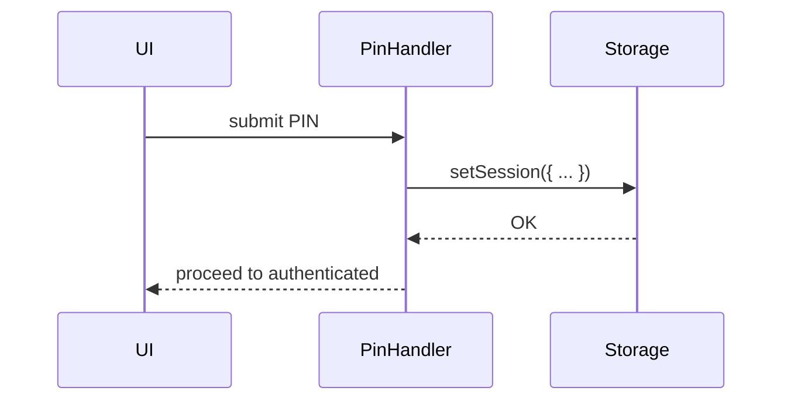

# 02 - Session Management

This section explains how **sessions** are managed in the 7awel wallet.

## Storage Keys & Structure
- **Key:** `app_session` (secure storage)
- **Session Shape:**
  ```ts
  interface Session {
    isActive: boolean
    lastActivity: number
    expiresAt: number
    pinVerified: boolean
  }
  ```

## TTL and Idle Timeout
- **Default TTL:** 30 minutes (`SESSION_TTL_MS`)
- **Idle timeout:** configurable via `SESSION_IDLE_TIMEOUT_MS`

## Core Functions (`utils/storage.ts`)
- `getSession(): Promise<Session  null>`
- `setSession(session: Session): Promise<void>`
- `clearSession(): Promise<void>`

### Behavior
1. `getSession()` validates JSON shape and expiration; clears if expired.
2. `setSession()` saves session state.
3. `clearSession()` removes stored data.

## Integration Points
- **PIN Verification:** `pinEntryHandler` in `context/auth-step-handlers.ts` invokes `setSession()` on success.
- **App Init:** `AuthContext` reads `getSession()` to decide whether to prompt for PIN or consider user authenticated.

## Sequence Diagram

