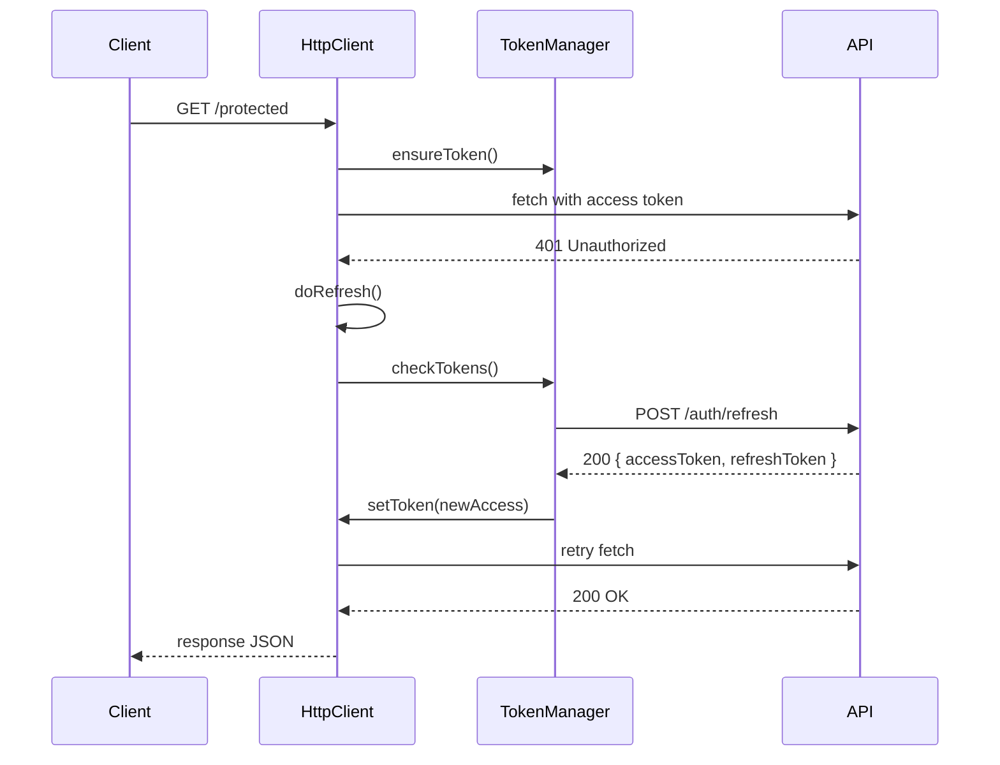

# 03 - Token Management

This section details how access and refresh tokens are handled and propagated.

## useTokenManager Hook (`context/auth/hooks/useTokenManager.ts`)

- **checkTokens()**:
  1. Reads `AUTH_TOKEN` and `REFRESH_TOKEN` from secure storage.
  2. Validates access token expiry via `isTokenExpired()`.
  3. If expired and a refresh token exists, calls `apiService.refreshToken()`.
  4. On success, stores new tokens and updates:
     - `apiService.setToken(accessToken)`
     - `httpClient.setToken(accessToken)`
  5. Returns `{ authToken, isValid }`.

- **setTokens(accessToken, refreshToken?)**:
  - Persists tokens in secure storage (`AUTH_TOKEN`, `REFRESH_TOKEN`).
  - Calls:
    - `apiService.setToken(accessToken)`
    - `httpClient.setToken(accessToken)` or `httpClient.clearToken()`

- **clearTokens()**:
  - Removes both tokens from storage.
  - Calls `apiService.setToken(null)` and `httpClient.clearToken()`.

- **Background Refresh**:
  - Runs every 5 minutes via `setInterval` in a `useEffect`.
  - Invokes `checkTokens()` and dispatches `LOGOUT` if invalid.

## HttpClient (`services/http-client.ts`)

- **initInterceptors(onAuthError)**:
  - Registers a handler invoked on 401/403 responses.
  - Uses **single-flight** (`doRefresh()`) to prevent concurrent refresh calls.

- **setRetryOptions(maxRetries, retryDelayMs)**:
  - Configures number of retry attempts and delay between them.

- **requestWithAuthRetry(fn)**:
  1. Executes `fn()` (the fetch call).
  2. On error with status 401/403, calls `doRefresh()`:
     - Runs `onAuthError()`, then clears the internal `refreshing` promise.
  3. Retries `fn()` up to `maxRetries`, waiting `retryDelayMs` between attempts.
  4. Throws the last error if retries exhaust.

### Sequence Diagram

