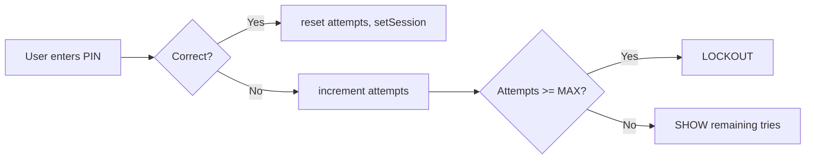

# 05 - PIN Management

This section covers how the wallet handles user PIN setup, validation, and lockout.

## usePinManager Hook (`context/auth/hooks/usePinManager.ts`)

- **setPin(pin: string): Promise<boolean>**
  - Hashes PIN via `hashPin(pin)` and stores using `setPinHash(hash)`.
  - Resets attempt counter (`resetPinAttempts()`).
  - Dispatches `SET_STEP_DATA` with `{ pinSet: true }`.

- **validatePin(pin: string): Promise<boolean>**
  - Retrieves stored hash via `getPinHash()`.
  - Compares with `verifyPin(pin, hash)`.
  - On success: resets attempts, returns `true`.
  - On failure: increments attempts (`incrementPinAttempts()`),
    - If attempts ≥ `MAX_PIN_ATTEMPTS`, dispatches `LOCKOUT`.
    - Else dispatches `SET_FLOW_ERROR` with remaining tries.
  - Returns `false`.

- **checkPin(pin: string): Promise<boolean>** (no increment)
- **isPinSet(): Promise<boolean>**
- **clearPin(): Promise<boolean>** resets hash & attempts, dispatches `pinSet: false`.

## Storage Keys & Helpers (`utils/storage.ts`)

- **PIN_HASH_KEY** (`app_pin_hash`)
- **PIN_ATTEMPTS_KEY** (`app_pin_attempts`)
- **PIN_LOCK_UNTIL_KEY** (`app_pin_lock_until`)

- **getPinHash(), setPinHash(), clearPinHash()**
- **getPinAttempts(), incrementPinAttempts(), resetPinAttempts()**
- **getPinLockUntil(), setPinLockUntil()**

## Step Handler Integration

- `pinSetupHandler` in `auth-step-handlers.ts` calls `setPin()` to create new PIN.
- `pinEntryHandler`:
  - Uses `verifyPin()` then `setSession()` on success.
  - Implements attempt limit, lockout dispatch.

## UI Components

- `PinSetup.tsx` – form to set new PIN.
- `PinPad.tsx` – form to enter existing PIN.
- `PinChange.tsx` – flow to reset PIN after forgotten/lockout.

## Lockout Behavior

- After `MAX_PIN_ATTEMPTS` (default 5), user is locked:
  - `getPinLockUntil()` stores timestamp until lock expires.
  - UI shows lock message and countdown.

